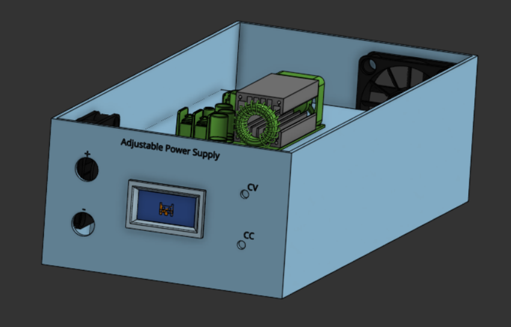
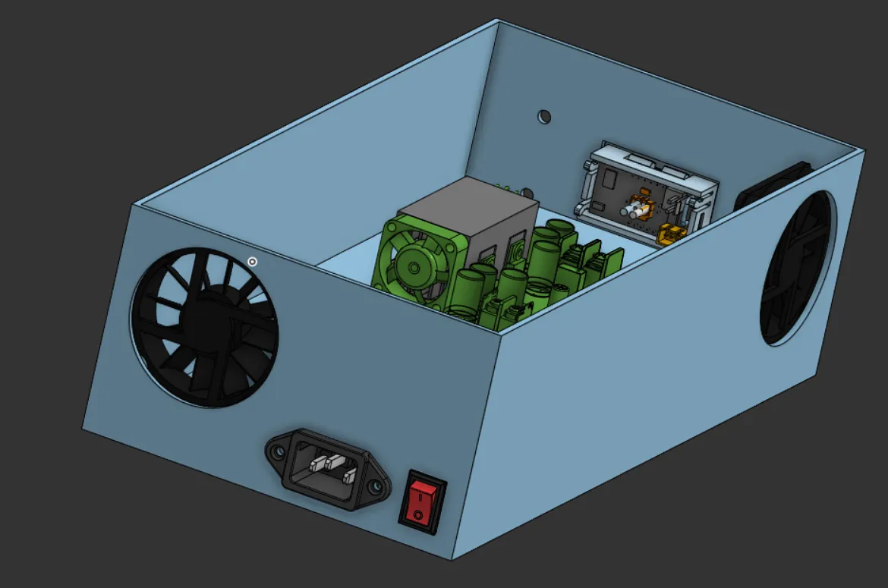
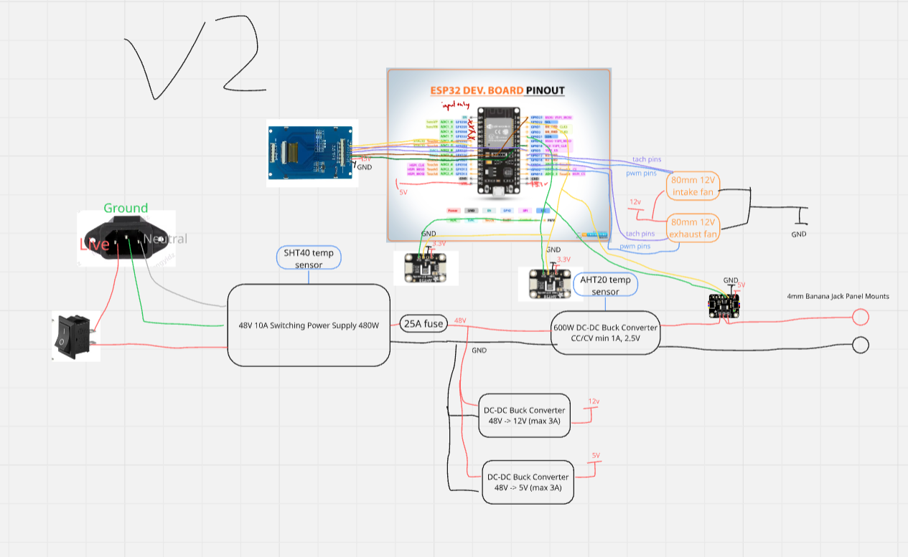

# Adjustable Power Supply
A cheap 500W adjustable power supply. 2.5-38V, 1-20A

I started this project to make electronics experimentation easier, because getting precise voltage and current levels is a pain if you don't have an adjustable psu.

## Parts List
> [!IMPORTANT]
> **Find the CSV format in [BOM.csv](/BOM.csv)**

### Cooling
- 1x of 60x60x10mm PWM Fan (Delta EFB0612HHA), TYPE standard 4pin/6010/EFB0612HHA, PRICE $3.96: https://www.aliexpress.com/item/2255800737378210.html
- 1x of 60x60x10mm PWM Fan (ADDA AD06012HX10AB00), TYPE Standard 4PIN PWM/black/NO RGB, PRICE $5.98: https://www.aliexpress.com/item/2251832835370376.html
- 1x of 50pcs/lot Aluminum Heatsink 8.8\*8.8\*5mm Electronic Chip Radiator Cooler w/ Thermal for IC,3D Printer, TYPE N/A, PRICE $2.42: https://www.aliexpress.com/item/2251832663311102.html

### Sensors + Modules
- 1x of SHT40 Temperature & Humidity Sensor Module, TYPE SHT40/China Mainland, PRICE $2.14: https://www.aliexpress.com/item/3256809091535018.html
- 1x of AHT20 + BMP280 Temp/Humidity/Pressure Sensor, TYPE Module, PRICE $1.63: https://www.aliexpress.com/item/3256806795952050.html
- 1x of ESP32 WROOM-32 Dev Board (USB-C), TYPE 1PCS-CP2102 TYPE-C, PRICE $0.99: https://www.aliexpress.com/item/3256805767190776.html
- 1x of INA228 Voltage/Current/Power Monitor Module, TYPE 228 welding, PRICE $5.70: https://www.aliexpress.com/item/3256810323201401.html
- 1x of 3.5" TFT LCD Screen (ST7796, 320x480), TYPE N/A, PRICE $7.56: https://www.aliexpress.com/item/3256809650697406.html
- 1x of Adjustable Buck Converter 60V 3A, TYPE 2-34V, PRICE $3.33: https://www.aliexpress.com/item/3256806811379418.html
- 1x of Buck Converter 60V 3A (5V Output), TYPE 5V, PRICE $3.25: https://www.aliexpress.com/item/3256806811379418.html
- 1x of Buck Converter 60V 3A (12V Output), TYPE 12V, PRICE $3.34: https://www.aliexpress.com/item/3256806811379418.html
- 1x of 600W CC/CV Buck Converter (12–75V Input), TYPE N/A, PRICE $11.66: https://www.aliexpress.com/item/3256807619950116.html

### Power + Wires
- 1x of 5Pcs Circuit Breaker Overload Protector Switch Fuse 3A 4A 5A 8A 10A 12A 15A 18A 20A 25A 30A Resettable 220V with Waterproof Cap, TYPE 5pcs/25A, PRICE $5.42: https://www.aliexpress.com/item/3256806057525580.html
- 1x of IEC C13 AC Power Cable (USA Plug, 1.2m), TYPE USA, PRICE $3.50: https://www.aliexpress.com/item/3256807060355465.html
- 1x of IEC C14 Panel Mount AC Socket, TYPE Type 4/China Mainland, PRICE $1.34: https://www.aliexpress.com/item/3256808473935736.html
- 1x of 4mm Banana Jack Panel Mount (Red), TYPE Red/1PCS, PRICE $1.34: https://www.aliexpress.com/item/3256805937948099.html
- 1x of 4mm Banana Jack Panel Mount (Black), TYPE black/1PCS, PRICE $1.26: https://www.aliexpress.com/item/3256805937948099.html
- 1x of Banana Plug to Alligator Clip Test Leads (20A, 90cm), TYPE N/A, PRICE $3.05: https://www.aliexpress.com/item/3256806675649321.html
- 1x of KCD1 Rocker Switch SPST, TYPE KCD1 15X20mm/5PCS, PRICE $2.40: https://www.aliexpress.com/item/3256808591861621.html
- 1x of 22 AWG Silicone Wire (4 colors, 25ft each), TYPE 22 gauge silicone wire each color 25ft, PRICE $9.98: https://www.amazon.com/gp/product/B07HGT44XY/
- 1x of 48V 10A Switching Power Supply (480W), TYPE N/A, PRICE $26.99: https://www.amazon.com/gp/product/B096VJMQFM/
